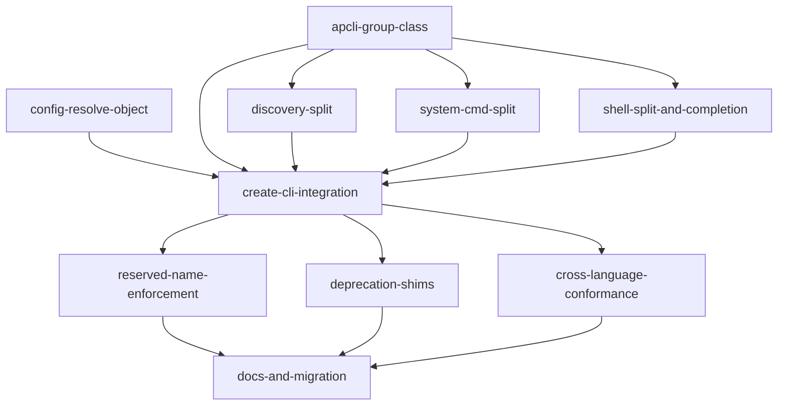

# Implementation Plan: Built-in Command Group (apcli) — FE-13

## Goal

Restructure the apcore-cli TypeScript command surface so that every library-provided command (`list`, `describe`, `exec`, `validate`, `init`, `health`, `usage`, `enable`, `disable`, `reload`, `config`, `completion`, `describe-pipeline`) lives under a single reserved `apcli` Commander sub-group, gated by a 4-tier visibility resolver (`CliConfig.apcli` > `APCORE_CLI_APCLI` > `apcore.yaml` > auto-detect), retire the legacy `BUILTIN_COMMANDS` collision surface in favor of `RESERVED_GROUP_NAMES = frozen({"apcli"})`, and ship a v0.7.x deprecation shim for standalone users — all within the existing TypeScript + Commander.js + vitest stack and a 5 % startup-time budget.

---

## Architecture Design

### Component Map

| Layer | File | Role |
|-------|------|------|
| Core visibility | `src/builtin-group.ts` (NEW) | `ApcliGroup` class, `RESERVED_GROUP_NAMES`, `APCORE_CLI_APCLI` env parser, `ApcliConfig` type |
| Config resolution | `src/config.ts` (EXTEND) | Add `ConfigResolver.resolveObject(key)` (non-leaf, non-flattened) + DEFAULTS for `apcli.mode`, `apcli.include`, `apcli.exclude`, `apcli.disable_env` |
| Command registrars (split) | `src/discovery.ts`, `src/system-cmd.ts`, `src/shell.ts` (EXTEND) | One-to-one `registerXCommand(apcliGroup, …)` functions replacing monolithic batch registration |
| Already-targeted registrars | `src/strategy.ts`, `src/init-cmd.ts` (EXTEND — caller only) | No internal change; `createCli` passes the `apcli` Commander group instead of root |
| Dispatcher | `src/main.ts` + `src/cli.ts` (EXTEND) | `createCli({apcli})` builds `ApcliGroup`, `_registerApcliSubcommands()` central dispatch table, gate `--extensions-dir`/`--commands-dir`/`--binding` on `!registry`, strip `BUILTIN_COMMANDS`, wire `RESERVED_GROUP_NAMES` |
| Reserved-name enforcement | `src/cli.ts` `GroupedModuleGroup` (EXTEND) | Replace warn-and-drop with hard exit 2 when group / auto-group / top-level alias is `apcli` |
| Deprecation shims | `src/main.ts` (EXTEND) | Register thin root-level shim commands standalone-only that log `WARNING` and forward to `<cli> apcli <name>` |
| Shell completion | `src/shell.ts` `generateBash/Zsh/Fish` (EXTEND) | Enumerate Commander-registered `apcli` subcommands at generation time — drop hardcoded `opts="completion describe exec init list man"` and `knownBuiltins` Set |
| Public surface | `src/index.ts` (EXTEND) | Export `ApcliGroup`, `ApcliConfig`, `RESERVED_GROUP_NAMES`; remove `BUILTIN_COMMANDS` re-export |

### Data Flow

```
createCli({registry?, executor?, apcli?})
        │
        ▼
   registry_injected = registry !== undefined
        │
        ▼
   Build ApcliGroup
        │   ├─ apcli is ApcliGroup → use as-is (_fromCliConfig already set)
        │   ├─ apcli is boolean|object → ApcliGroup.fromCliConfig(apcli, {registryInjected})
        │   └─ apcli is undefined   → ApcliGroup.fromYaml(
        │                                  ConfigResolver.resolveObject("apcli"),
        │                                  {registryInjected})
        ▼
   resolveVisibility() → one of "all" | "none" | "include" | "exclude"
        │   Tier 1: _fromCliConfig && _mode !== "auto"  → _mode
        │   Tier 2: !_disableEnv && APCORE_CLI_APCLI in {show,hide,1,0,true,false}
        │   Tier 3: _mode !== "auto"                    → _mode
        │   Tier 4: registryInjected ? "none" : "all"
        ▼
   Root program.addCommand(apcliGroup, {hidden: !isGroupVisible()})
        ▼
   _registerApcliSubcommands(apcliGroup, apcliCfg, registry, executor)
        │   For each (name, registrar, requiresExecutor) in TABLE:
        │     skip if requiresExecutor && !executor
        │     if mode ∈ {all, none}: registrar()  (always register, group hidden flag controls UX)
        │     else:                  if name ∈ _ALWAYS_REGISTERED || isSubcommandIncluded(name): registrar()
        ▼
   if (!registry_injected):
        │   program.option("--extensions-dir …")
        │   program.option("--commands-dir …")
        │   program.option("--binding …")
        │   _registerDeprecationShims(program, apcliGroup)  // warn + forward
```

### `ApcliGroup` API (mirrors `ExposureFilter` shape; does NOT subclass)

```typescript
export type ApcliMode = "all" | "none" | "include" | "exclude";
export type ApcliConfig =
  | boolean
  | {
      mode: ApcliMode;
      include?: string[];
      exclude?: string[];
      disableEnv?: boolean;
    };

export const RESERVED_GROUP_NAMES: ReadonlySet<string> = new Set(["apcli"]);

export class ApcliGroup {
  private constructor(
    private readonly _mode: ApcliMode | "auto",
    private readonly _include: ReadonlySet<string>,
    private readonly _exclude: ReadonlySet<string>,
    private readonly _disableEnv: boolean,
    private readonly _registryInjected: boolean,
    private readonly _fromCliConfig: boolean,  // Tier 1 marker — set at construction, never re-derived
  ) {}

  static fromCliConfig(cfg: ApcliConfig | undefined, opts: { registryInjected: boolean }): ApcliGroup;
  static fromYaml    (cfg: ApcliConfig | undefined, opts: { registryInjected: boolean }): ApcliGroup;

  resolveVisibility(): ApcliMode;        // one of "all"|"none"|"include"|"exclude" (never "auto")
  isSubcommandIncluded(name: string): boolean;  // asserts mode ∈ {include, exclude}
  isGroupVisible(): boolean;             // visibility !== "none"
}
```

### Tier Precedence Encoding — Critical Detail

The Tier 1 vs Tier 3 distinction is carried by the `_fromCliConfig` boolean set at construction time in `fromCliConfig` / `fromYaml`, NOT re-derived at dispatch time. This is the only way to correctly implement "env var overrides yaml but not programmatic config." An `ApcliGroup` instance passed directly by the integrator (`createCli({apcli: new ApcliGroup(…)})`) MUST be treated as Tier 1 — `ApcliGroup.fromCliConfig()` sets `_fromCliConfig = true`, so pre-built instances coming in via that channel already carry the flag. A direct-passed instance (Tier-1 channel) goes through without re-dispatch.

### `_registerApcliSubcommands` Central Dispatcher

A single, flat registrar table in `src/main.ts` (NOT re-abstracted into a plugin system — two concrete callers only: embedded and standalone modes):

```typescript
const _ALWAYS_REGISTERED: ReadonlySet<string> = new Set(["exec"]);

// (name, registrar, requiresExecutor)
const registrars: Array<[string, () => void, boolean]> = [
  ["list",              () => registerListCommand(apcliGroup, registry),              false],
  ["describe",          () => registerDescribeCommand(apcliGroup, registry),          false],
  ["exec",              () => registerExecCommand(apcliGroup, registry, executor),    true ],
  ["validate",          () => registerValidateCommand(apcliGroup, registry, executor),true ],
  ["init",              () => registerInitCommand(apcliGroup),                        false],
  ["health",            () => registerHealthCommand(apcliGroup, executor),            true ],
  ["usage",             () => registerUsageCommand(apcliGroup, executor),             true ],
  ["enable",            () => registerEnableCommand(apcliGroup, registry),            false],
  ["disable",           () => registerDisableCommand(apcliGroup, registry),           false],
  ["reload",            () => registerReloadCommand(apcliGroup, registry),            false],
  ["config",            () => registerConfigCommand(apcliGroup, executor),            true ],
  ["completion",        () => registerCompletionCommand(apcliGroup),                  false],
  ["describe-pipeline", () => registerPipelineCommand(apcliGroup, executor),          true ],
];
```

### `ConfigResolver.resolveObject()` Semantics

`ConfigResolver.resolve()` (src/config.ts:106) is scalar-only because `flattenDict` (src/config.ts:195) eagerly flattens the parsed yaml into dot-path leaves. Adding `resolveObject(key)` requires:

- A parallel `rawCache` populated from the un-flattened parsed object (or a walk of the original parsed dict by dot-path that skips flattening).
- Returns the **literal node** at the non-leaf key: `boolean | Record<string, unknown> | null | undefined`. Does NOT coerce.
- Leaf lookups (e.g., `apcli.mode`) continue to use `resolve()`; `ApcliGroup.fromYaml` consumes the object form only.

DEFAULTS entries to add (snake_case dot-notation per project convention):

```typescript
DEFAULTS = {
  // ...existing...
  "apcli.mode":        "auto",   // internal sentinel — users writing "auto" in yaml get exit 2
  "apcli.include":     [],
  "apcli.exclude":     [],
  "apcli.disable_env": false,
};
```

### Hidden-vs-Reachable Asymmetry (the FE-12 alignment)

| Mode | Subcommand registered? | Group hidden in root `--help`? |
|------|------------------------|--------------------------------|
| `all`     | All   | No |
| `none`    | All   | Yes  |
| `include` | Only names in `include` + `exec` | No |
| `exclude` | All except names in `exclude` (but `exec` always registered) | No |

Group-level hide (`mode: none`) is an **output filter** — `<cli> apcli list` still works. Subcommand-level hide (`include`/`exclude`) is **surface reduction** — filtered names are unreachable, except `exec`. **Shell completion must enumerate the Commander-registered subcommands, never call `isSubcommandIncluded()` directly** — this was the draft-v1 regression (T-APCLI-40 is the guard).

### Deprecation Shim Shape

Only in standalone mode (`!registry_injected`). A small helper in `src/main.ts`:

```typescript
function _registerDeprecationShims(program: Command, apcliGroup: Command): void {
  const DEPRECATED = ["list","describe","exec","validate","init","health","usage",
                      "enable","disable","reload","config","completion","describe-pipeline"];
  for (const name of DEPRECATED) {
    const shim = program.command(name).helpOption(false).allowUnknownOption(true);
    shim.action((...args) => {
      process.stderr.write(
        `WARNING: '${name}' as a root-level command is deprecated. ` +
        `Use 'apcli ${name}' instead. Will be removed in v0.8.\n`
      );
      // forward raw args to apcli <name>
      const sub = apcliGroup.commands.find(c => c.name() === name);
      if (sub) sub.parse(process.argv.slice(process.argv.indexOf(name)+1), {from: "user"});
    });
  }
}
```

Only names actually registered on `apcliGroup` get a shim (covers include/exclude partial-expose case automatically).

### Anti-abstraction Justifications

- `ApcliGroup` — two concrete callers: `createCli({apcli: bool|object})` and `createCli({apcli: new ApcliGroup(...)})`. Not a base class, not a strategy pattern.
- Registrar split — two concrete callers per registrar: `_registerApcliSubcommands` central dispatch + individual unit tests. Each split function has a single responsibility (one command), replacing bundled registration that couldn't be filtered.
- `resolveObject` — two concrete callers: `ApcliGroup.fromYaml` and (future) any FE-feature that needs object-typed yaml. Explicitly NOT generalized into a schema-aware resolver.

---

## Task Breakdown

### Dependency Graph



### Tasks

| ID | Description | Est. | Depends on |
|----|-------------|------|------------|
| **apcli-group-class** | Create `src/builtin-group.ts` with `ApcliGroup` class, `ApcliConfig`/`ApcliMode` types, `RESERVED_GROUP_NAMES`, and `APCORE_CLI_APCLI` env parser (WARN on unknown per `src/approval.ts:123-137` pattern). Mirror `ExposureFilter.fromConfig` validate/dedup/warn shape (`src/exposure.ts:96-140`) — do NOT subclass. Unit tests: `tests/builtin-group.test.ts` covering the tier matrix (T-APCLI-10 through T-APCLI-15, T-APCLI-20, T-APCLI-23, T-APCLI-25, T-APCLI-26, T-APCLI-37, T-APCLI-38, T-APCLI-39, T-APCLI-41). Test scaffolding: mirror `tests/exposure.test.ts` idioms, use `vi.spyOn(process.stderr,"write")` for warning capture. | ~4 h | — |
| **config-resolve-object** | Extend `src/config.ts`: add `ConfigResolver.resolveObject(key: string): unknown` that walks the parsed YAML without using `flattenDict`. Add `apcli.mode`/`apcli.include`/`apcli.exclude`/`apcli.disable_env` to DEFAULTS. Extend `registerConfigNamespace`. Invalid-mode (including `"auto"`) must exit 2 via `EXIT_CODES.INVALID_CLI_INPUT`. Tests in `tests/config.test.ts` confirm non-flattened subtree retrieval and DEFAULTS presence. | ~2 h | — |
| **discovery-split** | Refactor `src/discovery.ts`: split `registerDiscoveryCommands` (src/discovery.ts:67) into `registerListCommand`, `registerDescribeCommand`, add new `registerExecCommand` (single `apcli exec <module-id>` dispatcher — currently module execution is per-module via `buildModuleCommand`). Keep `registerValidateCommand` standalone. All attach to the passed-in `apcli` Commander group. Unit tests verify each registrar attaches exactly one subcommand; execution parity with pre-v0.7 behavior per T-APCLI-19, T-APCLI-24. | ~3 h | apcli-group-class |
| **system-cmd-split** | Refactor `src/system-cmd.ts`: split monolithic `registerSystemCommands` (src/system-cmd.ts:118) into `registerHealthCommand`, `registerUsageCommand`, `registerEnableCommand`, `registerDisableCommand`, `registerReloadCommand`, `registerConfigCommand`. Share the probe helper via internal closure/module-level cache (unchanged behavior). Unit tests for each registrar. | ~3 h | apcli-group-class |
| **shell-split-and-completion** | Refactor `src/shell.ts`: split `registerShellCommands` (src/shell.ts:568) into `registerCompletionCommand` (moves under `apcli`); `man` stays at root via `configureManHelp`. **Rewrite** `generateBashCompletion` / `generateZshCompletion` / `generateFishCompletion` (src/shell.ts:45/96/163) to enumerate the actually-registered subcommands on the `apcli` group via Commander introspection — drop hardcoded `opts="completion describe exec init list man"` and `knownBuiltins` Set (src/shell.ts:600). Regression tests for T-APCLI-29, T-APCLI-30, T-APCLI-40 (mode:none still yields full completion list). | ~4 h | apcli-group-class |
| **create-cli-integration** | Thread everything together in `src/main.ts` + `src/cli.ts`. Add `apcli?: ApcliConfig \| ApcliGroup` to `CreateCliOptions` (src/main.ts:195). In `createCli` (src/main.ts:226): build `ApcliGroup` via the three-branch dispatch (instance / fromCliConfig / fromYaml), add `apcli` Commander group with `hidden = !apcliCfg.isGroupVisible()`, call `_registerApcliSubcommands`, gate the three discovery flags (src/main.ts:275-277) on `!registry_injected`, reattach strategy (`src/strategy.ts:118 registerPipelineCommand`) and init (`src/init-cmd.ts:60 registerInitCommand`) callers to the `apcli` group, delete `BUILTIN_COMMANDS` constant + its two usages in `src/cli.ts` and the `src/main.ts:27` import, and delete the re-export from `src/index.ts:15`. Export `ApcliGroup`, `ApcliConfig`, `RESERVED_GROUP_NAMES` from `src/index.ts`. Integration tests in `tests/main.test.ts` cover T-APCLI-01 through T-APCLI-09, T-APCLI-18, T-APCLI-22, T-APCLI-27, T-APCLI-28, T-APCLI-33, T-APCLI-34, T-APCLI-36. | ~5 h | apcli-group-class, config-resolve-object, discovery-split, system-cmd-split, shell-split-and-completion |
| **reserved-name-enforcement** | In `src/cli.ts` `GroupedModuleGroup._buildGroupMap` (near src/cli.ts:319/385-392): replace warn-and-drop loop with hard-fail via `process.stderr.write` + `process.exit(EXIT_CODES.INVALID_CLI_INPUT)` when a module's resolved group name ∈ `RESERVED_GROUP_NAMES`, when auto-grouped prefix ∈ `RESERVED_GROUP_NAMES`, or when a top-level (no-dot) module's alias is in `RESERVED_GROUP_NAMES`. Also update `src/main.ts:347-348` `extraCommands` collision check to use `RESERVED_GROUP_NAMES`. Tests use the `vi.spyOn(process,"exit")` exit-2 pattern from `tests/cli.test.ts:61-106` to assert T-APCLI-16, T-APCLI-17. | ~2 h | create-cli-integration |
| **deprecation-shims** | Add `_registerDeprecationShims(program, apcliGroup)` helper in `src/main.ts`, invoked only when `!registry_injected`. Register a thin root-level shim for each `apcli`-registered subcommand that (a) writes the WARNING to stderr and (b) forwards to the matching `apcli` subcommand. Tests: shim present in standalone mode + stderr WARNING emitted; shim absent in embedded mode. Gated on v0.7.x (no feature flag — direct logic). | ~2 h | create-cli-integration |
| **cross-language-conformance** | Write `conformance/fixtures/apcli-visibility/` input/output pairs (T-APCLI-31) for the key cross-language scenarios (`apcli: false` embedded, `apcli: true` standalone, `mode: include list`, `mode: include + empty + disable_env`). Node-side integration test that runs the TypeScript CLI against each fixture and asserts byte-matching `--help` output. Python parity is verified manually against `../apcore-cli-python/` where feasible. T-APCLI-32 (startup time within 5 % of baseline) lives here as a benchmark smoke test — `hyperfine` or a Node `performance.now()` comparison on a pre-commit baseline. | ~3 h | create-cli-integration |
| **docs-and-migration** | Update `CHANGELOG.md` with v0.7.0 entry documenting the breaking change + migration table (spec §11.1). Update `README.md` (remove `BUILTIN_COMMANDS` reference at line 191; add `apcli` group documentation + migration pointer). Update `CLAUDE.md` "v0.6.0 Conventions" section into a new "v0.7.0 Conventions" section describing `RESERVED_GROUP_NAMES`, `ApcliGroup`, `ConfigResolver.resolveObject`, and the retirement of `BUILTIN_COMMANDS`. Purge any remaining `BUILTIN_COMMANDS` string references via grep. | ~1 h | reserved-name-enforcement, deprecation-shims, cross-language-conformance |

---

## Risks and Considerations

1. **Tier-precedence bug resurgence (draft-v1 regression).** Draft v1 had shell completion hiding subcommands that were actually reachable under `mode: none`. Guard: T-APCLI-40 is a regression test asserting `<cli> apcli <TAB>` under `mode: none` yields ALL subcommands. Completion generators MUST enumerate Commander's actually-registered subcommand list — never consult `isSubcommandIncluded()`.
2. **`ConfigResolver.resolveObject` MUST NOT flatten.** The existing `flattenDict` (src/config.ts:195) eagerly walks the parsed dict into dot-leaf pairs. A naive `resolveObject("apcli")` call on the flattened cache would reconstruct a dict missing top-level boolean shorthand (`apcli: true` would be lost). Implementation must either cache the un-flattened parse tree in parallel or walk the source object directly.
3. **`exec` always-registered invariant.** The `_ALWAYS_REGISTERED = new Set(["exec"])` rule must survive `include: []`, `exclude: ["exec"]` (should be silently ignored for `exec`), and the `requiresExecutor && !executor` early-skip. Test: T-APCLI-41 asserts the total-lockdown shape still has `exec` reachable.
4. **Startup performance 5 % budget (T-APCLI-32).** Adding an extra Commander group + 13 conditional registrations + the env-var lookup + a ConfigResolver non-leaf walk must stay within 5 % of the pre-v0.7 baseline. Measure with Node `performance.now()` on `apcore-cli --version` (cold node start excluded). If a regression, revisit the ConfigResolver cache strategy before refactoring the dispatcher.
5. **Cross-language parity with Python reference (T-APCLI-31).** The TypeScript `ApcliConfig` (`disableEnv` camelCase) and Python (`disable_env` snake_case) must resolve to identical visibility for equivalent inputs. Conformance fixture YAML uses snake_case; the TypeScript side accepts both `disableEnv` (JS/TS idiomatic) and — optionally — `disable_env` (yaml pass-through). Decision: the CliConfig interface uses camelCase; the YAML config always uses snake_case; `resolveObject("apcli")` returns the raw snake_case node and `ApcliGroup.fromYaml` translates.
6. **Registry/ModuleDescriptor placeholder divergence (known gap from CLAUDE.md).** This feature does NOT close that gap. All task code uses the local placeholder interfaces (`listModules`, `getModule`, `id`). Integrator responsibility to adapt upstream apcore-js registries — unchanged from v0.6.0.
7. **Deprecation shim + extraCommands collision.** Shims are only registered in standalone mode AFTER `extraCommands` processing. If a standalone user has an `extraCommand` named `list`, the shim registration must detect the conflict and skip (not throw). Log a single `WARNING` at registration time.
8. **Sandbox / Executor placeholder.** Unrelated to this feature; carry forward unchanged.

---

## Acceptance Criteria

- [ ] All tests T-APCLI-01 through T-APCLI-41 pass (or are explicitly deferred with a documented reason — e.g., T-APCLI-31 cross-language parity is a conformance gate when Python reference is available).
- [ ] `pnpm test` — green with no skipped relevant specs.
- [ ] `npx tsc --noEmit` — zero errors.
- [ ] `pnpm build` — succeeds.
- [ ] No `BUILTIN_COMMANDS` references remain anywhere in `src/`, `tests/`, `README.md`, or `CLAUDE.md` (verify via `grep -r BUILTIN_COMMANDS .`).
- [ ] `src/index.ts` exports `ApcliGroup`, `ApcliConfig`, `RESERVED_GROUP_NAMES`; does NOT export `BUILTIN_COMMANDS`.
- [ ] `CHANGELOG.md` has a v0.7.0 entry calling out the breaking change + migration link.
- [ ] `CLAUDE.md` has a v0.7.0 Conventions section.
- [ ] Startup-time benchmark (`apcore-cli --version`) within 5 % of pre-v0.7 baseline (T-APCLI-32).
- [ ] Deprecation shim writes `WARNING: ... deprecated ... Will be removed in v0.8 ...` to stderr on root-level invocation, standalone mode only.
- [ ] Reserved-name violation exits with code 2 and a clear stderr message (T-APCLI-16, T-APCLI-17).

---

## References

- **Feature spec:** `../apcore-cli/docs/features/builtin-group.md`
- **Tech design §8.2.7:** `../apcore-cli/docs/tech-design.md` (canonical `create_cli` signature)
- **Python reference:** `../apcore-cli-python/apcore_cli/builtin_group.py`, `apcore_cli/__main__.py`
- **Project conventions:** `CLAUDE.md` (TypeScript strict + ESM + Commander.js + vitest; `pnpm test` must pass; snake_case DEFAULTS; `process.stderr.write()` + `EXIT_CODES` over throwing)
- **Related features:**
  - FE-01 Core Dispatcher — `../apcore-cli/docs/features/core-dispatcher.md`
  - FE-04 Discovery — `../apcore-cli/docs/features/discovery.md`
  - FE-07 Config Resolver — `../apcore-cli/docs/features/config-resolver.md` (FE-07 impact: `resolveObject` method)
  - FE-09 Grouped Commands — `../apcore-cli/docs/features/grouped-commands.md` (retires `BUILTIN_COMMANDS`, introduces `RESERVED_GROUP_NAMES`)
  - FE-11 Usability — `../apcore-cli/docs/features/usability-enhancements.md`
  - FE-12 Exposure Filtering — `../apcore-cli/docs/features/exposure-filtering.md` (orthogonal; shares `exec` always-registered guarantee)
- **Reused existing modules:**
  - `src/exposure.ts` (shape template for `ApcliGroup`)
  - `src/approval.ts:123-137` (env-var read + WARN idiom)
  - `src/logger.ts` (`warn()` for config warnings)
  - `src/errors.ts:71` (`EXIT_CODES.INVALID_CLI_INPUT`)
  - `src/output.ts` (`resolveFormat`, `formatExecResult` — unchanged by relocation)
- **Reused test scaffolding:**
  - `tests/grouped-commands.test.ts:19` `makeMod` / `:38` `makeRegistry` / `:45` `mockExecutor` / `:49` `makeGroupedGroup`
  - `tests/exposure.test.ts` (template for `ApcliGroup` unit tests)
  - `tests/cli.test.ts:61-106` (`vi.spyOn(process,"exit")` for exit-2 assertions)
  - `tests/main.test.ts:36/97` (`createCli` fixtures for embedded vs standalone)
